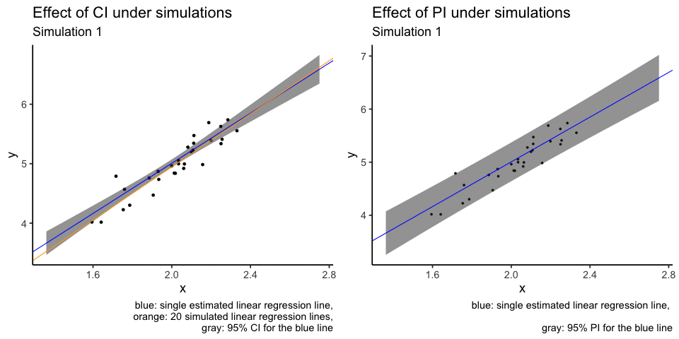

# Introduction 

How can we (statisticians) better explain the differences between a confidence interval (CI) and a prediction interval (PI)? Sure, one could look up the definition on Wikipedia and memorise the definitions, but the real difficulty is how to communicate this clearly to young students/collaborators/clients without using mathematical formalism. For a linear regression model and a given value of the independent variable, the CI and PI confusingly share the same point estimate. Worse still, if we write out the mathematical formulas, they are virtually identical except one term!

The difference between the interpretation of CI and PI is actually a great example of how very similar mathematical constructions can lead to very different interpretations. These terms are not always rigorously defined and used, sometimes even in reputable sources (I would also add tolerance intervals here as well, but perhaps for another day).

This blog post explains the main statistical differences between CI and PI in a linear regression model through visualisations. In short:

+ CI shows the variability in **parameter estimates**. The primary intention is to understand the **variability in the model**.

+ PI shows the variability in **individual data points**. The primary intention is to **capture future data points**. 





The statements above are of course extreme simplifications of these statistical concepts. I will attempt to minimise the need for mathematical derivations and use intuitive language and simulations to illustrate the subtle differences between these two concepts. 

# A quick simulation to set the scene

Suppose we have an independent variable ($x$) and a dependent variable ($y$) and we are asked to produce a linear regression. 

For simplicity, I will generate some data with $X \sim N(2,0.2^2)$, $\epsilon \sim N(0, 0.2^2)$ and $y = 1 + 2*x + \epsilon$. As much as I would like to use real data to add real-world relevance, generating data with a known value means that we are allowed to discuss how good our estimates are compared to the "true" value. This idea of a "true" value is not always possible if we use real data.

```{r}
## Some packages that we will be using
suppressPackageStartupMessages({
  library(tidyverse)
  library(broom)
  library(ggpubr)
})
```

We will also use the `geom_smooth(method = "lm")` function from the `ggplot2` package to add the (simple) linear regression line. I also choose to use the option `se = FALSE` to suppress the visualisation of the (confidence) interval as we will do this manually later. 

```{r}
set.seed(8)
theme_set(theme_classic(18))

n = 30
x = rnorm(n, 2, 0.2)
epsilon = rnorm(n, 0, 0.2)
y = 1 + 2*x + epsilon

df = tibble(x, y)

model = lm(y ~ x, data = df)

df %>% 
  ggplot(aes(x = x, y = y)) +
  geom_point() +
  geom_smooth(method = "lm", se = FALSE) +
  ggpubr::stat_regline_equation()
```


# Confidence interval (CI)

## On a single parameter

```{r, include=FALSE}
ci = confint(model)
slope_estimate = round(model$coefficients[2], 1)
```


**Definition**: if we are asked to construct a 95% CI for a parameter, then the probability* that this CI will contain the *true* population parameter value is 95%. We can replace the "95%" with any other percentage that we can think of, though it is rare for us to consider something below 90%.

*The word "probability" is to be interpreted using a frequentist approach. See bonus section 1. 

For example, if we were to look at the linear model above, the true slope value is 2, because that is how we generated the data through a formula. But the point estimate for this parameter is about `r slope_estimate` (formula in the top left corner of the plot), not exactly 2. You may ask, what is going on?! 

This is because any data sampled from a population, being only a sample, cannot encapsulate entirely what is going on in the population. Our point estimate (in this case, `r slope_estimate`) is estimated using our data, and thus, can't be numerically identical to the true parameter (in this case, 2) that is associated with a population. This interplay between an estimate and the parameter of interest (or similarly, between a sampled data and the underlying population) is a fundamental concept in statistics. 

We can think of a CI as being another estimate for the population parameter. Unlike a point estimate, which is just a point, a CI is an interval defined between an upper bound and a lower bound. The midpoint of a CI is the point estimate. Thus, we can think of a CI as a way to quantify the variability for that point estimate*!

<!-- And if a CI contains the parameter of interest (in this case, 2), then we may retain the null hypothesis that the population parameter is 2. Notice how I used the phrase "null hypothesis" here, that is because there is a equivalence relationship between $(1−\alpha)\%$ CI and hypothesis testing with alpha as the significance level. -->

*Interestingly, in my experience, a point estimate, being just a single number, can often mislead some people into thinking that there is a lot of certainty behind this number when it absolutely does not! The associate CI could be quite large even if your point estimate looks very reasonable. 

The confidence interval for the slope parameter can be computed as `r paste0("(", round(ci[2,1], 4), ", ", round(ci[2,2],4), ")")` using the code below. Notice how the point estimate of `r slope_estimate` is halfway between the two bounds and that this CI also contains the true parameter value of 2. Similarly, one can construct confidence interval for the intercept term as `r paste0("(", round(ci[1,1], 4), ", ", round(ci[1,2],4), ")")`.

```{r}
confint(model)
```

## Visualisation

We now have a basic understanding of what a CI is with respect to a single parameter, but who cares about a single parameter anyways? After all, a statistical model could have many parameters, how would knowing a single one enhance our knowledge of the entire model?

Here is where a bit of creative visualisation can help us! Notice how the linear regression model, written out as a formula, is $y = \alpha + \beta x + \epsilon$ with $\alpha$ and $\beta$ being the population intercept and slope parameters, respectively. When we make estimations on these parameters, our linear model, as a straight line is $y = \hat{\alpha} + \hat{\beta} x + \epsilon$, where $\hat{\alpha}$ and $\hat{\beta}$ estimate $\alpha$ and $\beta$ respectively. So if we have the CIs quantifying the variability of$\hat{\alpha}$ and $\hat{\beta}$, then we should also be able to produce a CI associated with the linear model itself! And by doing so, we can get a better idea of how **variable** the entire model is because we know how variable the individual estimates are!

Even if you didn't understand the above, the CI associated with the linear model is simply the gray area produced by `geom_smooth(method = "lm", se = TRUE)` when using `ggplot2`! You can think of this line as how the linear model line (blue) "jiggles" if you have (future) data sampled from the same underlying distribution.

```{r}
df %>%
  ggplot(aes(x = x, y = y)) +
  geom_point() +
  ggpubr::stat_regline_equation() +
  geom_smooth(method = "lm", se = TRUE)
```

# Prediction interval (PI)

## On a single data point

**Definition**: If we were to construct a 95% prediction interval for a given value of $x$ for a given linear model, then the probability that it will contain the corresponding value of $y$ is 95%.

This is fundamentally different to a confidence interval, because CI tries to quantify the variability of an estimate, but PI is aiming to capture the variability of a (future) data point, $y_{new}$, given some $x_{new}$ value. In other words, a CI tries to quantify the behaviour of an estimate (obtained through averaging many data points), but a PI tries to quantify the behaviour of a single data point. Thus, we should expect, through simple intuition, that individual behaviour is more variable than the averaged behaviour. And so, **PI is usually wider than a CI**.

The main source of confusion for some people is that, both CI and PI share the same point estimate, i.e. $\hat{\alpha} + \hat{\beta} \bar{x}$. It also doesn't help when these concepts are sometimes mixed up and talked about as though they are interchangeable in some colloquial settings.

One can compute the point prediction value and the 95% PI in `R` using the code below. Though admittedly, we are simply producing predictions for the original data, not new data (thus the warning message in `R`).

```{r}
predict(model, interval = "prediction") %>% head
```


# Visualisation

In my experience, PI's are more intuitive to understand than CI's. PI is simply a region to capture new data, but CI is about how the model "jiggles".

It is slightly harder to generate a PI using `ggplot2` with some customisation needed for the `geom_smooth` function. Thus, I will attempt to generate both CI and PI manually and use `ggplot2` for visualisation. I particularly like the `broom::augment` function to generate these intervals here.

```{r}
ci = broom::augment(model, interval = "confidence")
pi = broom::augment(model, interval = "prediction")

plotdf = tibble(
  x = ci$x,
  y = ci$y, 
  line = ci$.fitted,
  ci_lwr = ci$.lower,
  ci_upr = ci$.upper,
  pi_lwr = pi$.lower,
  pi_upr = pi$.upper)

plot1 = plotdf %>% 
  ggplot(aes(x = x, y = y)) +
  geom_point() + 
  geom_line(aes(x = x, y = line), colour = "blue") +
  geom_ribbon(aes(x = x, ymin = ci_lwr, ymax = ci_upr), fill = "gray20", alpha = 0.3) +
  labs(caption = "blue: single estimated linear regression line,
       gray: 95% CI")

plot1
```

```{r}
plot2 = plot1 + 
  geom_ribbon(aes(x = x, ymin = pi_lwr, ymax = pi_upr), colour = "red", alpha = 0) +
  labs(caption = "blue: single estimated linear regression line,
      red: 95% PI,
      gray: 95% CI")

plot2
```

From the plot, I would like to reiterate this idea that a CI (gray region) tries to quantify averaged behaviour of a model (blue line), and notice how small the jiggling is. But a PI (red lines) tries to quantify the behaviour of individual data points, and thus PI is much wider, because individuals are less predictable than the average.

# Bonus 1: probability and confidence level

In all the writings above, I have always assumed that we already know what a probability/confidence level is. However, this might not be fair and I would like to explain this concept better in this section.

In most introductory statistics courses, the first definition of probability is likely to be the frequentist definition, which is closely related to the concept of (re-)sampling. In our definition of CI above, we used 95% confidence level as the default. This means that, if we were to repeatedly sample new data of the same sample size from the population, and construct the CI in the same way, then the proportion of times that the CIs containing the true population parameter is 95%. This idea of "repeated sampling" applies to both PI and TI. Thus, even though in the definitions above, we have used the words "probability" and "confidence level" interchangeably, but in the most rigorous way, these interval concepts should only be interpreted through repeated sampling. We will do this in bonus section 2. 

# Bonus 2: visualisation through repetitions

We will now repeat the data generation process 100 times and compute the corresponding statistics. The code below is not quite readable unless you are already familiar with `tidyverse` and nested `tibble`. The essence of the code is to first construct data in exactly the same way as we have above. And then, for each of the 100 data generation, we will then extract the corresponding fitted line, CI and PI for visualisation. 

```{r}
library(gganimate)
nsim = 100 ## Number of simulations
n = 30

sim_tbl = tibble(
  x = rnorm(n*nsim, 2, sd = 0.2),
  epsilon = rnorm(n*nsim, 0, sd = 0.2),
  y = 1 + 2*x + epsilon,
  sim_num = rep(1:nsim, n)) ## This tibble puts all the simulated data in one

sim_tbl

sim_lm_tbl = sim_tbl %>% 
  group_by(sim_num) %>% 
  tidyr::nest() %>% ## Group by simulation number and separately fit linear models
  dplyr::mutate(
    lm = purrr::map(.x = data, .f = ~ lm(y ~ x, data = .x)),
    lm_tidy = purrr::map(lm, broom::tidy))

sim_lm_tbl
```

## Fitted lines

For each the linear models that we have fitted, we will now extract the coefficients. We will perform additional manipulations for the purpose of plotting. 

Notice how even though we have many fitted lines, their deviations from the single fitted line are small and almost cover the same range as the confidence interval (gray region). This is exactly what a confidence interval is designed for: to capture how a single fitted line jiggles under sampling from the same population. 

```{r}
sim_coef_tbl = sim_lm_tbl %>% 
  dplyr::select(sim_num, lm_tidy) %>% 
  unnest(lm_tidy) %>% 
  dplyr::select(sim_num, term, estimate) %>%
  tidyr::pivot_wider(names_from = "term",
                     values_from = "estimate")

sim_coef_tbl

plot1 +
  geom_abline(slope = 2, intercept = 1) +
  geom_abline(data = sim_coef_tbl,
              aes(slope = x, intercept = `(Intercept)`),
              size = 0.3, alpha = 0.5, colour = "orange") +
  labs(title = "Fitted lines",
       subtitle = "",
       caption = "black: true linear relationship
       blue: single estimated linear regression line
       orange: 100 simulated linear regression lines,
       gray: 95% CI")
```

## Confidence intervals

What I don't like about the plot above is that orange lines are plotted over other elements of the plot, i.e. overplotting. Another attempt at the same visualisation is to use animation. I will use only the first 20 simulations.

```{r, eval = FALSE}
sim_coef_tbl20 = sim_coef_tbl %>% dplyr::filter(sim_num <= 20)
sim_tbl20 = sim_tbl %>% dplyr::filter(sim_num <= 20)

sim_conf_int = augment(model, newdata = sim_tbl20, interval = "confidence") %>% 
  dplyr::select(x, y, .lower, .upper)

animation1 = ggplot() +
  geom_point(data = sim_tbl20, aes(x = x, y = y)) +
  geom_ribbon(data = sim_conf_int, aes(x = x, y = y, ymin = .lower, ymax = .upper),
              alpha = 0.5) +
  geom_abline(intercept = model$coefficients[1],
              slope = model$coefficients[2], colour = "blue") +
  geom_abline(data = sim_coef_tbl20,
              aes(slope = x, intercept = `(Intercept)`), 
              colour = "orange") +
  transition_states(sim_num) +
  shadow_mark(exclude_layer = 1) +
  labs(title = "Effect of CI under simulations",
       subtitle = "Simulation {closest_state}",
       caption = "blue: single estimated linear regression line,
       orange: 20 simulated linear regression lines,
       gray: 95% CI for the blue line")

# animation1

# gganimate::anim_save(filename = "CI_animation.gif", animation = animation1)
```


```{r, eval = FALSE}
sim_pred_int = augment(x = model, newdata = sim_tbl20, interval = "predict") %>% 
  dplyr::select(x, y, .lower, .upper)

animation2 = sim_tbl20 %>% 
  ggplot(aes(x = x, y = y)) +
  geom_point(size = 1) +
  geom_ribbon(data = sim_pred_int, 
              aes(x = x, ymin = .lower, ymax = .upper), 
              fill = "gray20", alpha = 0.5) +
  geom_abline(intercept = model$coefficients[1],
              slope = model$coefficients[2], colour = "blue") +
  transition_states(sim_num) +
  shadow_mark(exclude_layer = 1) +
  labs(title = "Effect of PI under simulations",
       subtitle = "Simulation {closest_state}",
       caption = "blue: single estimated linear regression line, \n
       gray: 95% PI for the blue line")

# animation2

# gganimate::anim_save(filename = "PI_animation.gif", animation = animation2)
```


# Bonus 3: side by side animation

This [post](https://github.com/thomasp85/gganimate/wiki/Animation-Composition) shows how to put `gganimate` plots together.

```{r, eval = FALSE}
library(patchwork)
library(magick)
a_mgif <- image_read(animate(animation1))
b_mgif <- image_read(animate(animation2))

new_gif <- image_append(c(a_mgif[1], b_mgif[1]))
for(i in 2:20){
  combined <- image_append(c(a_mgif[i], b_mgif[i]))
  new_gif <- c(new_gif, combined)
}

gganimate::anim_save(filename = "combined_CI_PI_animation.gif", animation = new_gif)
```


# Bonus 4: Mathematical formulas

Ok, I promise this is the last bonus section. I am including some formulas for completeness here.

Suppose that our data design matrix is $X \in \mathbb{R}^{n \times p}$ and the response variable is $y \in \mathbb{R}^n$. If we set the confidence level to $(1-\alpha)\%$, then we will use $t_{n-p}^{(\alpha / 2)}$ to denote the Student t-distribution's critical value, with $n-p$ degrees of freedom.

For a new data point at $(x_{\text{new}}, y_{\text{new}})$, the estimated response is $\hat{y}_{new} = a + b x_{new}$, where $a$ and $b$ are estimated intercept and slope term respectively. The estimated linear regression residual standard deviation is $\hat{\sigma}$.

The confidence interval under this notation set up is: 

$$\hat{y}_{new} \pm t_{n-p}^{(\alpha / 2)} \hat{\sigma} \sqrt{x_{new}^{T}\left(X^{T} X\right)^{-1} x_{new}}.$$
The prediction interval under this notation set up is: 

$$\hat{y}_{new} \pm t_{n-p}^{(\alpha / 2)} \hat{\sigma} \sqrt{1+x_{new}^{T}\left(X^{T} X\right)^{-1} x_{new}}.$$
Notice that both formulas share the same point estimate of $\hat{y}_{new}$ and the only difference between these two formulas is the term `1` under the square root sign. But that single term makes up all the differences between these statistical concepts!
